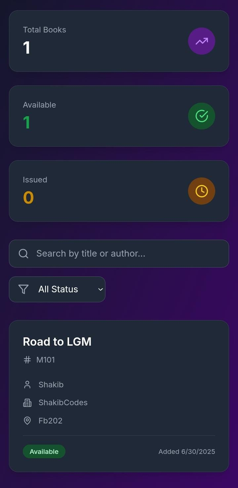

# Library Management 📚

[](https://shakibcodes.github.io/Library-Management/)


---

## 👋 About Library Management

**Library Management** is a smart, modern web platform designed to help you easily **upload and track book details**. It's perfect for individuals, schools, or any institution that needs to keep tabs on their book collection.

 

Say goodbye to messy spreadsheets and manual searches! This system streamlines book discovery, making it effortless to find and locate books in any library, big or small.

## ✨ Cool Features

* **⚡️ Easy Book Uploads:** Quickly add new books with all their details.

* **🔍 Powerful Search:** Find books instantly by title, author, or publisher.

* **📍 Location Tracking:** Keep track of a book's physical location within your library.

* **Responsive Design:** Works beautifully on desktops, tablets, and phones.

* **✅ Streamlined Workflow:** Simplify book management for any collection size.

* **🚀 Easy Deployment:** Get your library online fast with GitHub Pages.

---

## 🚀 How to Use It

Want to run Library Management on your computer? Here's how!

### What You Need

Make sure you have these installed:

* **Node.js**: [Download here](https://nodejs.org/) (includes npm)
* A web browser (like Chrome, Firefox, Edge, Safari)

### Steps to Install

1.  **Get the code:**

    ```bash
    git clone https://github.com/ShakibCodes/Library-Management.git
    cd BookHunt
    ```

2.  **Install dependencies:**

    ```bash
    npm install
    ```

### How to Run

1.  **Start the development server:**

    ```bash
    npm run dev
    ```
    This will usually open the application in your default web browser, or provide a local URL (e.g., `http://localhost:5173`) that you can open manually.

2.  **Start managing your books!**

    * Find the "Add New Book" section.
    * Fill in the book's details (title, author, publisher, location).
    * Use the search bar to quickly find books in your collection.

---

## 📸 Screenshots

| Dashboard | Add Book Form | Light Mode |
| :-------: | :-----------: | :------------: |
|  |  |  |

| Mobile Phone View |
| :---------------: |
|  |
|  |
---

## 🛠 What It's Built With

Library Management is crafted with modern web technologies:

* **TypeScript** - A superset of JavaScript that adds static typing.
* **Vite** - A lightning-fast build tool for modern web projects.
* and more

---

## 📄 License

This project uses the MIT License. See the `LICENSE` file for full details.

---

## 📞 Get in Touch

Have questions or want to connect? Reach out!

* **GitHub** - [https://github.com/ShakibCodes](https://github.com/ShakibCodes)
* **Portfolio Website :** [https://shakibsayyed.netlify.app/](https://shakibsayyed.netlify.app/)
* **Linkedin :** [https://www.linkedin.com/in/shakib-sayyed-81b9b4352/](https://www.linkedin.com/in/shakib-sayyed-81b9b4352/)

---
